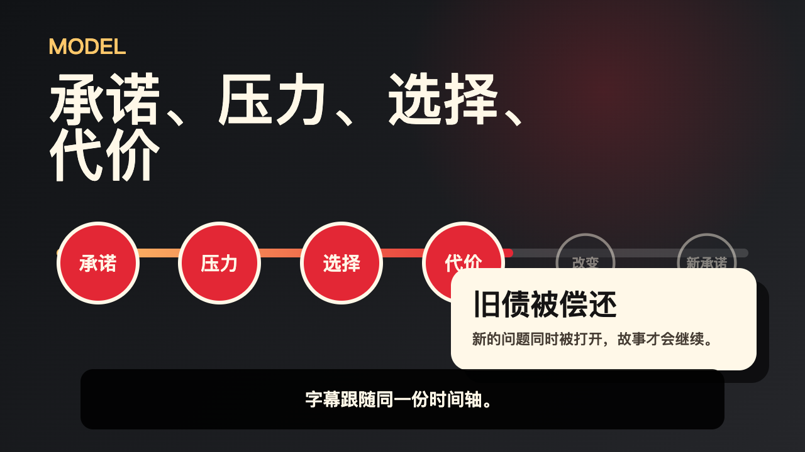
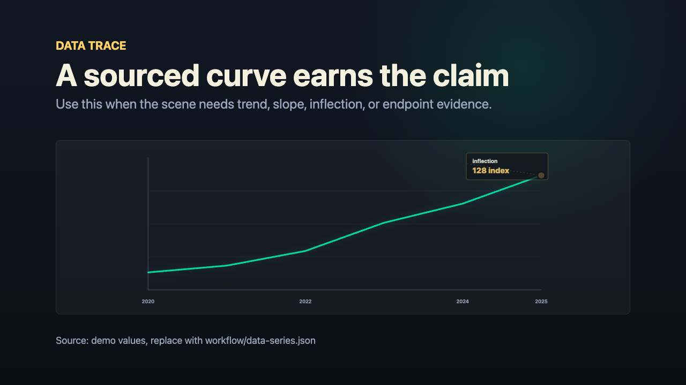
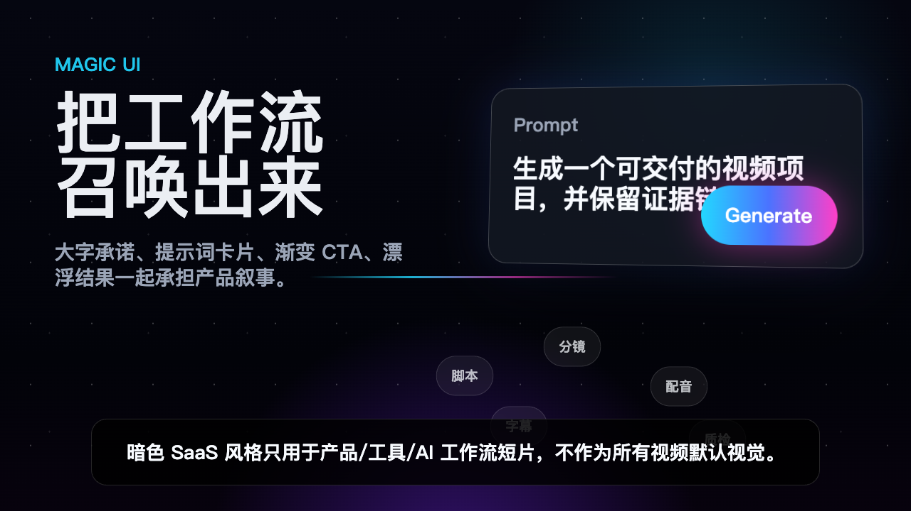

<p align="center">
  <strong>English</strong> · <a href="README.zh-CN.md">简体中文</a>
</p>

<p align="center">
  
</p>

<h2 align="center">Turn a brief into a review-ready video package</h2>

<p align="center">
  A local-first workflow for content planning, voice timing, semantic motion, captions, and covers.<br>
  Every production stage leaves a clear, reusable output.
</p>

<p align="center">
  <a href="media/showcase/workflow-film/codex-video-workflow.mp4"><strong>Watch an example</strong></a> ·
  <a href="#quick-start"><strong>Quick start</strong></a> ·
  <a href="#configuration">See the bilingual console</a>
</p>

---

## What it solves

Many video tools generate a clip. Codex Video Workflow manages the production chain around it: understand the source, shape the story, choose a visual language, build voice and captions on shared timing, design platform covers, and package everything for review and revision.

It is designed for:

- **Creators** turning articles, methods, lessons, or scripts into structured videos.
- **Knowledge and Personal-IP channels** that need consistent presenters, diagrams, whiteboards, and readable captions.
- **Content teams** that want to configure styles and review pages before composition.
- **Automated workflows** that need scripts, visuals, audio, captions, covers, and delivery records to share one production context.

```text
Brief → Content structure → Visual design → Voice and timing → Motion and captions → Covers → Delivery
```

## What you get

| Output | Why it matters |
| --- | --- |
| A title-named MP4 | Ready for review, editing, or the next publishing step |
| Horizontal, vertical, and platform covers | Re-composed for each surface instead of mechanically cropped |
| Narration, captions, and storyboard | Easy to verify, revise, and hand off |
| `delivery.html` | One place to review the video, covers, copy, and materials |
| Structured production records | Support targeted repairs, reuse, and issue tracing |

## See it in action

[](media/showcase/workflow-film/codex-video-workflow.mp4)

This film is not a decorative template reel. It shows how content enters the video: process nodes communicate progress, curves communicate change, relationship lines communicate causality, product surfaces communicate state, and Personal-IP or whiteboard pages carry teaching content.

- Motion is attached to a content object and an explanatory job.
- Images, charts, captions, presenters, and interfaces participate in the narrative.
- Horizontal, vertical, Personal-IP, whiteboard, and platform-cover outputs use their own composition rules.
- Voice, captions, and scene changes share one timing source.

## Core capabilities

### Content before templates

The workflow identifies the audience, claim, steps, proof, turn, and conclusion before choosing a visual treatment. A tutorial becomes steps and checkpoints, data becomes trends and inflection points, and complex relationships become traceable paths.

| Semantic timeline | Data curve |
| --- | --- |
| [](media/showcase/templates/semantic-timeline-reveal.png) | [](media/showcase/templates/data-curve-trace.png) |

### Motion that explains

Every motion decision has a job: reveal, compare, connect, trace, accumulate, inspect, or resolve a state. The result is closer to an explainer, product film, or information visualization than an animated slide deck.

| Relationships and paths | Product states and actions |
| --- | --- |
| [](media/showcase/templates/gsap-semantic-flow.png) | [](media/showcase/templates/dark-saas-magic-ui.png) |

### Captions designed with voice

Captions are not a final text overlay. They are generated from the final spoken timing and planned together with keyword emphasis, frame safety, aspect ratio, and content density. The console offers treatments for tutorials, products, editorial ideas, data, bilingual content, and mobile video.

[](media/showcase/core-demo/config-caption-gallery.png)

### Independent cover design

Covers start from the video's truthful promise, then re-compose for list cards, horizontal players, vertical feeds, and profile grids. Each surface gets its own hierarchy and safe area rather than a crop of one master image.

<p align="center">
  
  
  
</p>

### Personal IP and whiteboard video

The Personal-IP route uses a consistent presenter anchor and native page system for courses, methods, and creator-led explanations. Whiteboard motion traces paths, circles nodes, and reveals relationships over a stable page while keeping captions above the drawing layer.

| Horizontal Personal-IP explainer | Vertical Personal-IP whiteboard |
| --- | --- |
| [](media/showcase/personal-ip/example-film/personal-ip-two-page-horizontal.mp4) | [](media/showcase/personal-ip/demos/personal-ip-whiteboard-vertical-6s.mp4) |

> Public examples use a fictional generic host and do not represent the user. A specific persona consistency chain is created only from user-provided and authorized role material.

<a id="configuration"></a>

### Bilingual configuration and page review

When more control is needed, generate the Chinese/English configuration console first. Choose aspect ratio, visual treatment, captions, materials, covers, and voice, then review page-level content, design, and subtitle decisions before composition.

| Chinese configuration | English configuration |
| --- | --- |
| [](media/showcase/core-demo/semi-auto-config.html) | [](media/showcase/core-demo/semi-auto-config.html?lang=en) |

[Download the bilingual configuration page](media/showcase/core-demo/semi-auto-config.html?raw=1) · [Browse the motion design catalog](media/showcase/core-demo/motion-style-template-review.html)

<details>
<summary><strong>Explore the full design choice surface</strong></summary>

The configuration experience currently includes:

- curated motion combinations for horizontal and vertical content;
- tutorial, editorial, kinetic, product-UI, bilingual, and mobile caption treatments;
- editorial, product, whiteboard, archive, creator, and data-oriented palettes;
- problem-to-proof, method roadmap, contrast reveal, data proof, Personal-IP, and platform-native cover strategies;
- Chinese, English, bilingual, and locally available voice options;
- page-level Text / Design / Subtitle review.

[View motion choices](media/showcase/core-demo/config-motion-all-families.png) · [View caption choices](media/showcase/core-demo/config-caption-gallery.png) · [View the cover workbench](media/showcase/core-demo/config-cover-workbench.png)

</details>

## Two ways to work

| Mode | Best for | How it works |
| --- | --- | --- |
| **Full Auto** | A clear brief that should go directly to a video package | Plans content, builds voice timing, pages, captions, covers, and delivery outputs |
| **Configure and Review** | Choosing the direction first or reviewing as a team | Generates the console and page review surfaces, then composes after confirmation |

Both modes use the same content, visual, and delivery contracts, so a fast run can move into detailed review without changing systems.

<a id="quick-start"></a>

## Quick start

### 1. Install the Skill

```bash
git clone https://github.com/wpowen/videocreat.git
cd videocreat

export CODEX_HOME="${CODEX_HOME:-$HOME/.codex}"
mkdir -p "$CODEX_HOME/skills/codex-video-workflow"
rsync -a SKILL.md scripts/ assets/ references/ templates/ vendor/ \
  "$CODEX_HOME/skills/codex-video-workflow/"
```

Restart Codex after installation so the Skill catalog reloads.

### 2. Start in natural language

Full Auto example:

```text
Use codex-video-workflow to turn this brief into a 16:9 Chinese method explainer.
Use Full Auto and generate captions, platform covers, and a delivery page.
```

Configure and Review example:

```text
Use codex-video-workflow to create a bilingual configuration page for this brief first.
Let me choose the aspect, visual style, captions, covers, and page content before composition.
```

See [SKILL.md](SKILL.md) for the command-line entrypoint, parameters, and full workflow contract.

## Output structure

```text
<output>/
├── <video-title>.mp4
├── delivery.html
├── cover/
├── 最终成品/
├── script/
│   ├── narration.txt
│   ├── storyboard.md
│   └── subtitles.srt
└── workflow/
    └── production and review records
```

## Included capabilities

| Skill | Role |
| --- | --- |
| `codex-video-workflow` | Coordinates content, voice, pages, motion, captions, composition, and delivery |
| `codex-video-cover-generation` | Designs and generates independent platform covers |
| `build-*` visual modules | Produce knowledge boards, strategy guides, relationship maps, atlases, editorial pages, ink pages, interfaces, and progression collages |

## Usage boundaries

- This project produces a **review-ready pre-publishing package**. Material rights, platform rules, AI labels, and final editorial approval remain the publisher's responsibility.
- Generated imagery and native platform covers should be completed and inspected in a Codex environment with `image_gen` support.
- The configuration catalog represents available design choices, not one finished video per combination.
- Automatic caption routing still has a small set of known regression cases; confirm the caption treatment in the configuration console for critical work.

## Documentation

- [Full Skill contract](SKILL.md)
- [Generation modes](references/generation-modes.md)
- [Content presentation design](references/content-presentation-design.md)
- [Caption design](references/subtitle-design.md)
- [Cover design](references/cover-design.md)
- [Personal-IP integration](references/ip-diagram-creator-integration.md)
- [Quality standards](references/quality-gates.md)
- [Showcase asset notes](media/showcase/README.md)

## License

[MIT](LICENSE) · Contributions are welcome through [Issues](https://github.com/wpowen/videocreat/issues) and [Pull Requests](CONTRIBUTING.md).
