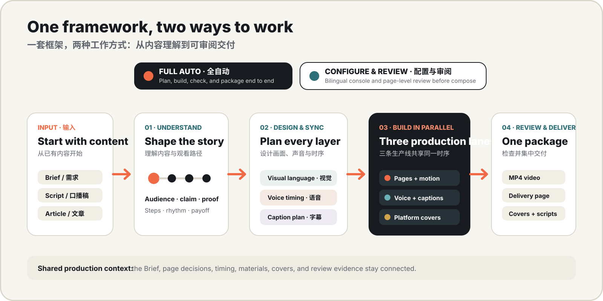
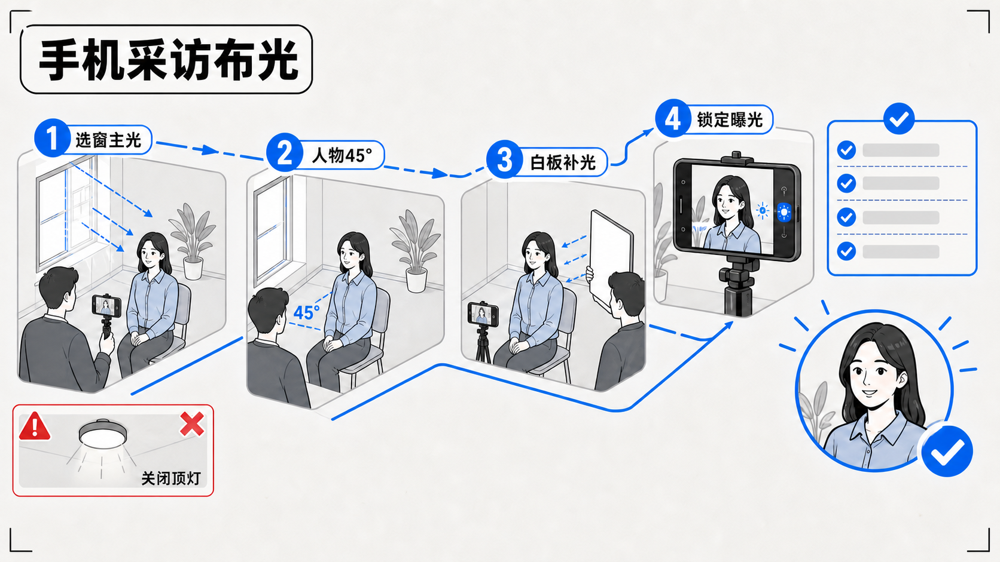
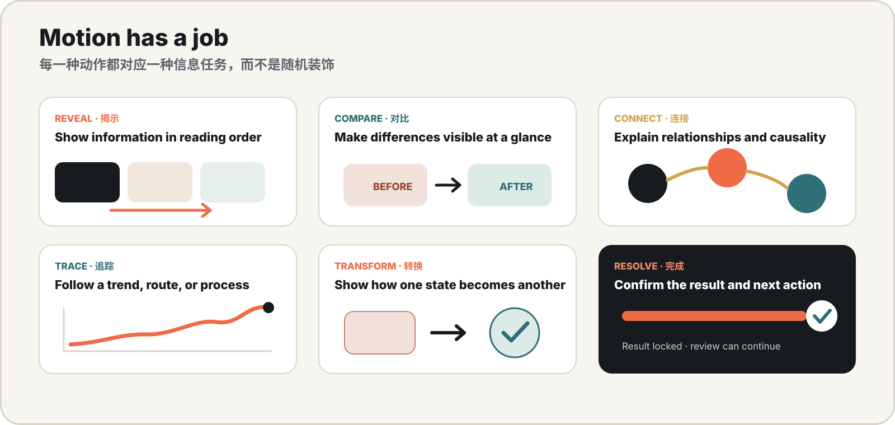
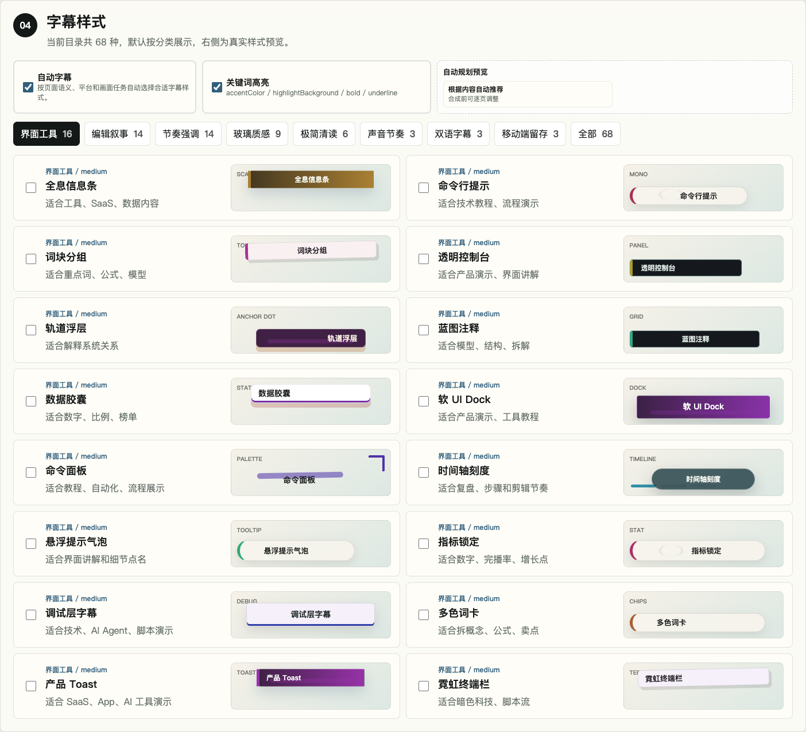
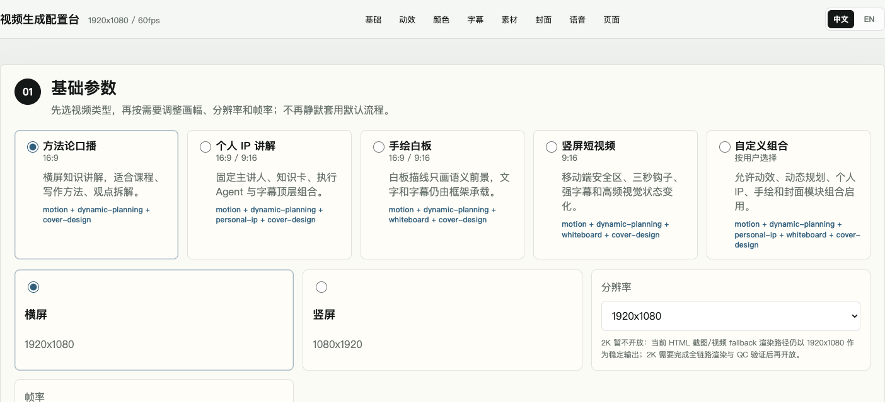
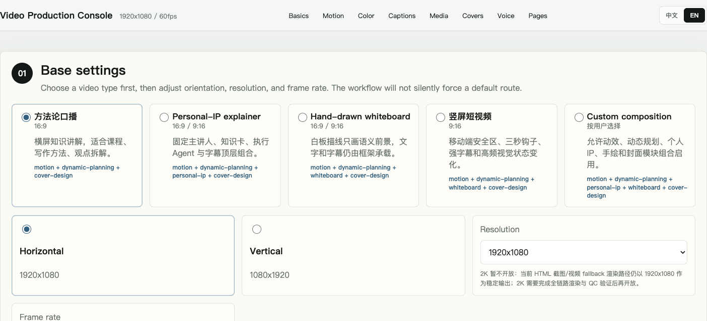

# Codex Video Workflow

<p align="center">
  <strong>English</strong> · <a href="README.zh-CN.md">简体中文</a>
</p>

<p align="center">
  
</p>

<h2 align="center">Turn a brief into a review-ready video production package</h2>

<p align="center">
  Codex Video Workflow is a local-first AI video production framework for content structure, visual direction,
  voice–caption sync, semantic motion, presenter-led and whiteboard pages, platform-specific covers, quality checks, and delivery.<br>
  Every stage leaves an inspectable output that can be reviewed, repaired, or reused.
</p>

<p align="center">
  <a href="#promotional-film"><strong>Watch the film</strong></a> ·
  <a href="#how-it-works"><strong>How it works</strong></a> ·
  <a href="#core-capabilities"><strong>Explore capabilities</strong></a> ·
  <a href="#quick-start"><strong>Quick start</strong></a> ·
  <a href="#configuration"><strong>Bilingual configuration</strong></a>
</p>

---

<a id="promotional-film"></a>

## Promotional film

[](https://cdn.jsdelivr.net/gh/wpowen/videocreat@4729a0e9f77fe44db39a08ada3bea427f1938872/media/showcase/workflow-film/codex-video-workflow.mp4)

<p align="center">
  <a href="https://cdn.jsdelivr.net/gh/wpowen/videocreat@4729a0e9f77fe44db39a08ada3bea427f1938872/media/showcase/workflow-film/codex-video-workflow.mp4"><strong>▶ Watch the 71-second framework film</strong></a> ·
  <a href="https://github.com/wpowen/videocreat/raw/main/media/showcase/workflow-film/codex-video-workflow.mp4">Download the original MP4</a>
</p>

The film demonstrates semantic motion, the real bilingual configuration console, visual pages, platform covers, Personal-IP and whiteboard content, caption routing, and the final delivery package. It is presented separately from the static workflow below so the README remains understandable even before playback.

## What the framework covers

Start with a brief, article, script, lesson, or existing media. The framework turns the source into one connected production context instead of a collection of unrelated files.

| Content | Production | Ways to work | Delivery |
| --- | --- | --- | --- |
| Audience, claim, proof, steps, and payoff | Visual pages, voice timing, captions, motion, materials, and covers | Full Auto or Configure & Review | Rendered MP4, platform covers, scripts, review page, and production records |

It is built for knowledge explainers, creator and Personal-IP content, hand-drawn whiteboards, product demonstrations, editorial videos, data stories, vertical short-form video, and reusable visual series.

<a id="how-it-works"></a>

## How it works

<p align="center">
  
</p>

Two working modes share the same content, timing, visual, and delivery contracts:

- **Full Auto** plans, builds, checks, and packages an end-to-end run from a clear brief.
- **Configure & Review** opens a bilingual console and page-level review before composition.
- **Shared production context** keeps page decisions, voice timing, captions, materials, covers, and review evidence connected, so a local repair does not require rebuilding everything.

## What you receive

| Output | Purpose |
| --- | --- |
| Rendered MP4 | Review, edit, or continue into the publishing workflow |
| Native-ratio platform covers | Separate compositions for horizontal players, vertical feeds, list cards, and profile grids |
| Narration, storyboard, and subtitles | Verify wording and timing or hand the package to another editor |
| `delivery.html` | Review video, covers, copy, and related assets in one place |
| Structured production records | Trace decisions, reuse approved work, and repair a specific stage |

<a id="core-capabilities"></a>

## Core capabilities

### Content becomes a visual system

The framework identifies the audience, central claim, steps, evidence, contrasts, and conclusion before it chooses a visual treatment. Each page is built around an information task—not a random template.

| Relationship map | Strategy guide |
| --- | --- |
|  |  |

### Motion has an explanatory job

Reveal information in reading order, compare two states, connect causes and effects, trace a trend, transform one state into another, or confirm a result. These semantic jobs let motion explain the content while voice, captions, and scene changes follow the same timing source.

<p align="center">
  
</p>

### Captions are designed with the voice

Captions are generated from final spoken timing and planned together with frame safety, keyword emphasis, content density, aspect ratio, and bilingual needs. The current catalog contains 68 treatments across interface, editorial, kinetic, glass, minimal, beat-synced, bilingual, and mobile-safe families.

<p align="center">
  
</p>

### Covers are rebuilt for each platform

A cover starts from the video's truthful promise and click motivation. The workflow then selects a design logic and composes each target natively instead of cropping one master image.

<p align="center">
  
</p>

Supported cover targets include:

| Surface | Native targets |
| --- | --- |
| Horizontal video and lists | 3840×2160, 1920×1080, 1280×720, 1600×1200, Bilibili 1146×717 |
| Vertical feeds and profiles | 1080×1920, 1080×1440, Reels 420×654 |
| Grids and opening frames | 1200×1200 and a video-canvas opening cover |

<p align="center">
  
</p>

| Native vertical cover | Native square cover |
| --- | --- |
|  |  |

Upload-ready generated covers require an environment with `image_gen`, native-ratio generation, and visual inspection. Without that provider, the workflow can still prepare the cover strategy, copy, prompts, targets, and review package without presenting a placeholder as a final cover.

### Presenter consistency and hand-drawn whiteboards

Build a reusable presenter or character definition from authorized source material, then carry it across creator-led explainers, courses, and visual series. Whiteboard pages reveal strokes, circle nodes, and explain relationships while keeping captions readable above the drawing layer.

| Presenter-led horizontal page | Vertical hand-drawn whiteboard |
| --- | --- |
|  |  |

> Public examples use a fictional presenter. A specific person or character is created only from user-provided, authorized materials.

<a id="configuration"></a>

### Bilingual configuration and page review

Choose the format, visual direction, motion route, color system, caption treatment, materials, cover strategy, and voice in Chinese or English. Then review page content, design, and subtitle decisions before final composition.

| Chinese configuration | English configuration |
| --- | --- |
| [](media/showcase/core-demo/semi-auto-config.html) | [](media/showcase/core-demo/semi-auto-config.html?lang=en) |

[Open the bilingual configuration page](media/showcase/core-demo/semi-auto-config.html) · [Browse the motion design catalog](media/showcase/core-demo/motion-style-template-review.html)

## Two ways to work

| Mode | Best for | Result |
| --- | --- | --- |
| **Full Auto** | A clear brief and an end-to-end first pass | Plans and produces the available video package, then runs the relevant checks |
| **Configure & Review** | Selecting a direction first or collaborating page by page | Creates the bilingual console and review surfaces before composition |

You can start fast and move into detailed review without changing production systems.

<a id="quick-start"></a>

## Quick start

### 1. Install the Skill

```bash
git clone https://github.com/wpowen/videocreat.git
cd videocreat

export CODEX_HOME="${CODEX_HOME:-$HOME/.codex}"
mkdir -p "$CODEX_HOME/skills/codex-video-workflow"
rsync -a SKILL.md scripts/ assets/ references/ templates/ vendor/ skills/ \
  "$CODEX_HOME/skills/codex-video-workflow/"
```

Restart Codex after installation so the Skill catalog reloads.

### 2. Start in natural language

Replace “this brief” with your Markdown, pasted text, file path, or attachment.

Full Auto:

```text
Use codex-video-workflow to turn this brief into a 16:9 Chinese method explainer.
Use Full Auto and prepare captions, platform covers, and a delivery page.
```

Configure & Review:

```text
Use codex-video-workflow to create a bilingual configuration page for this brief first.
Let me choose the aspect ratio, visual direction, captions, covers, and page content before composition.
```

See [SKILL.md](SKILL.md) for the entrypoint, parameters, and complete workflow contract.

## Output package

```text
<output>/
├── <video-title>.mp4
├── delivery.html
├── cover/
├── 最终成品/ (final assets)
├── script/
│   ├── narration.txt
│   ├── storyboard.md
│   └── subtitles.srt
└── workflow/
    └── production and review records
```

## Bundled capability modules

| Module | Role |
| --- | --- |
| `codex-video-workflow` | Coordinates content, voice, pages, motion, captions, composition, checks, and delivery |
| `codex-video-cover-generation` | Plans and generates independent platform-cover compositions |
| `build-*` visual modules | Build relationship maps, strategy guides, collection atlases, editorial pages, interfaces, ink pages, and progression collages |

## Known limitations and publishing responsibilities

- The output is a **review-ready pre-publishing package**. Material rights, platform rules, AI labels, and final editorial approval remain the publisher's responsibility.
- Generated imagery and upload-ready native covers require compatible generation providers and visual inspection.
- The design catalog shows the available choice surface; it is not a claim that every combination is a separately published demo video.
- For critical work, confirm automatically selected caption treatments in the configuration console before final composition.

## Documentation

- [Complete Skill contract](SKILL.md)
- [Generation modes](references/generation-modes.md)
- [Content presentation design](references/content-presentation-design.md)
- [Caption design](references/subtitle-design.md)
- [Cover design](references/cover-design.md)
- [Personal-IP integration](references/ip-diagram-creator-integration.md)
- [Quality standards](references/quality-gates.md)
- [Showcase asset notes](media/showcase/README.md)

## License

[MIT](LICENSE) · Contributions are welcome through [Issues](https://github.com/wpowen/videocreat/issues) and [Pull Requests](CONTRIBUTING.md).
