# Codex Video Workflow

<p align="center">
  <strong>English</strong> · <a href="README.zh-CN.md">简体中文</a>
</p>

<p align="center">
  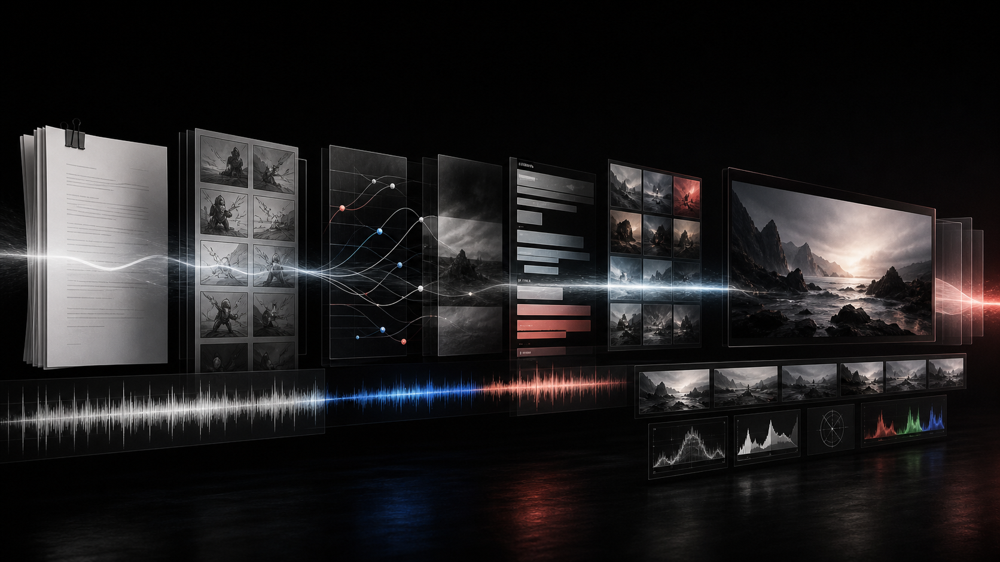
</p>

<h3 align="center">Turn one brief into an inspectable, repairable, evidence-backed video package</h3>

<p align="center">
  Full Auto · Bilingual Semi Auto · 160 Motion Contracts · 44 Config Color Systems · 68 Caption Styles · Covers · Personal IP · Whiteboard · Independent QC
</p>

<p align="center">
  <a href="media/showcase/capability-reel-v2/capability-showcase-v2.mp4"><strong>Watch the V2 semantic-motion reel</strong></a> ·
  <a href="media/codex-video-workflow-core-2026-zh.mp4">Watch the full workflow demo</a> ·
  <a href="media/showcase/core-demo/semi-auto-config.html">Open the bilingual console</a> ·
  <a href="media/showcase/core-demo/motion-style-template-review.html">Browse 160 motion combinations</a> ·
  <a href="SKILL.md">Read the Skill contract</a>
</p>

---

## The short version

`codex-video-workflow` is not a one-prompt MP4 generator. It is a local-first production chain with visible stages and fail-closed release gates.

```text
Brief → content and retention plan → local voice → real timing → pages and semantic motion
      → captions → independent cover lane → video QC / cover QC → evidence package
```

| Mode | Best for | Behavior | Evidence in this refresh |
| --- | --- | --- | --- |
| **Full Auto** | Going directly from brief to a review video | The default when no configuration mode is requested; plans, voices, renders, checks, and packages | A new 122.1s, 1920×1080, H.264/AAC review render; native platform covers are still pending |
| **Semi Auto** | Choosing styles, reviewing pages, or collaborating before composition | Explicit `--generation-mode semi-auto`; stops at the bilingual console and review artifacts | A generated console with 68 captions, 160 motion combinations, 12 cover logics, and 10 cover targets |

> Status language used below: ✅ current run evidence; 🧭 configurable catalog or review preview; ⏳ generation or QC still required. Catalog counts are not counts of finished videos.

## Start here: V2 is a semantic reel, not a style list

[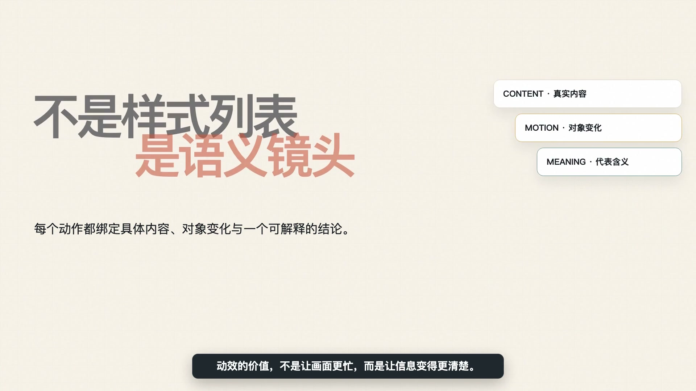](media/showcase/capability-reel-v2/capability-showcase-v2.mp4)

V2 was redesigned against the current framework. It no longer rushes through abstract cards. Every example makes the chain explicit: **concrete content → object change → what that motion means**.

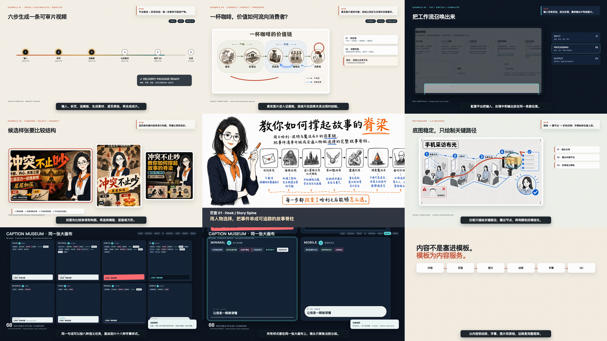

| Concrete example in the reel | Motion | Meaning communicated |
| --- | --- | --- |
| Six-stage review-video pipeline | Track growth, node completion, result lock | Stage progress and inspectable deliverables |
| Data-curve proof | Axes, trace, inflection callout | Trend, magnitude, metric definition, and source |
| Coffee value-chain image | Supply and feedback links appear | Images become evidence; connections express causality |
| Bilingual configuration console | Input, processing, and output focus | A real product operation changes visible state |
| Cover before/after | Compare, repair deltas, QC lock | Design improvement is structural, not a color swap |
| Template-choice matrix | Axes, candidates, target quadrant | Deterministic planning instead of random style choice |
| Multi-role swimlanes | Parallel work, handoff, merge | Owners, artifact boundaries, and final acceptance |
| Multi-ratio cover wall | Compare, select, magnify rationale | Structure and promise are chosen before ratio and color |
| Two-page Personal IP + 4.5s whiteboard | Native-page edit, trace, circle, fill | Persona continuity and layered annotation |

- ✅ 71.5 seconds, 1920×1080, 30fps, H.264/AAC, local Chinese MeloTTS narration
- ✅ The separately rendered two-page Personal-IP video is actually edited into the main reel
- ✅ The whiteboard segment is 4.5 seconds: stable base → trace → circle → semantic fill → reading hold
- ✅ All 68 caption styles live on one museum plane across eight semantic districts; only one narration cue owns the safe band at a time
- ✅ Project images, covers, configuration pages, and native IP pages are recorded in the [asset manifest](media/showcase/capability-reel-v2/workflow/visual-asset-manifest.json)
- ✅ Resolution, streams, codec, black-frame, layout, and catalog-coverage checks passed; see the [QC record](media/showcase/capability-reel-v2/logs/qc.json)

<details>
<summary><strong>Previous 38.4-second catalog-coverage reel</strong></summary>

The previous reel remains useful as union-coverage evidence for 32 families × 5 variants, 44 configuration systems, and 68 captions. It is no longer the primary promo because generic geometry does not fully explain each motion's content meaning. [Watch the catalog reel](media/showcase/capability-reel/capability-showcase.mp4).

</details>

## 2026 core capability demo

[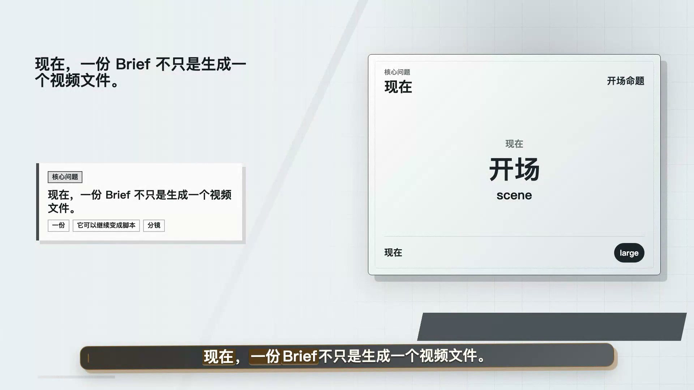](media/codex-video-workflow-core-2026-zh.mp4)

The new demo was regenerated from the current code. It covers full-auto and semi-auto operation, the bilingual console, semantic motion, caption and cover systems, the Personal-IP routing boundary, QC, and delivery evidence.

- ✅ 122.1 seconds, 1920×1080, H.264 + AAC
- ✅ Local female MeloTTS narration with caption timing bound to actual speech cues
- ✅ Black-frame, silence, decoding, resolution, stream, and loudness checks executed
- ⏳ Ten platform covers remain review previews; built-in Image2 generation, human inspection, ingestion, and cover QC are incomplete, so this run is not labeled publishing-ready
- 🧭 Personal IP is explained as a route boundary; the separate native-page evidence below is not presented as footage from this run

Inspect the source brief: [core-capability-demo-2026-brief-zh.json](media/oral-materials/core-capability-demo-2026-brief-zh.json).


## Two ways to use it

### Full Auto: render and check by default

```bash
node scripts/poc-video-workflow.mjs \
  --brief media/oral-materials/core-capability-demo-2026-brief-zh.json \
  --out /tmp/codex-video-core-demo \
  --mode recommended \
  --voice-backend melotts_local \
  --speech-style explainer \
  --image-source image2-dryrun \
  --no-open-output
```

CLI `image2-dryrun` creates inspectable image and cover requests, then remains incomplete at native-image gates. In a Codex App run with built-in `image_gen`, continue the image, cover, ingestion, and postflight stages before claiming publishing readiness.

### Semi Auto: configure before composition

```bash
node scripts/poc-video-workflow.mjs \
  --brief media/oral-materials/core-capability-demo-2026-brief-zh.json \
  --out /tmp/codex-video-core-demo-config \
  --generation-mode semi-auto \
  --voice-backend melotts_local \
  --image-source image2-dryrun \
  --no-open-output
```

Semi Auto produces the console, horizontal and vertical motion catalogs, a generation-mode contract, the caption plan, and `workflow/cover-size-selection.json` in a few seconds.

### Voice timing contract

Comma-like punctuation (`，`, `,`, `、`) keeps the sentence intact and uses a 0.5s in-clause pause when an explicit pause is needed. Sentence-ending punctuation stays on the TTS backend/default pause. Visual caption wrapping never becomes a new audio split.

## Bilingual configuration console

The `中文 / EN` switch updates the document locale, core navigation, major sections, primary actions, accessibility labels, and URL state. Some dynamically generated catalog names retain their source language so they can be matched to the underlying manifest.

| 中文基础设置 | English base settings |
| --- | --- |
| 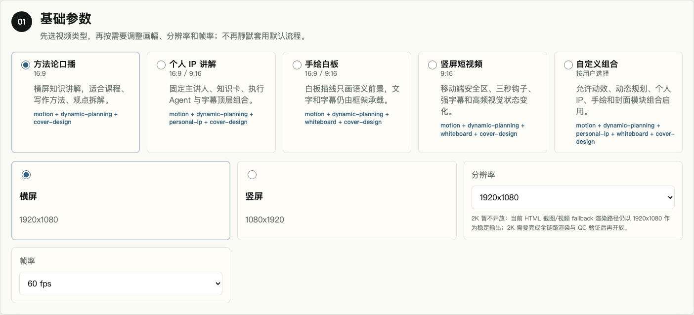 | 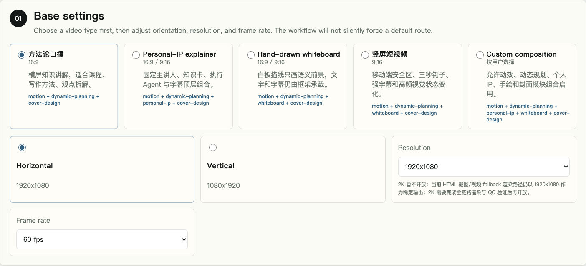 |

| 160 motion contracts | 68 caption styles |
| --- | --- |
|  |  |

| 44 configuration color systems | Cover workbench: logic + ratios |
| --- | --- |
| 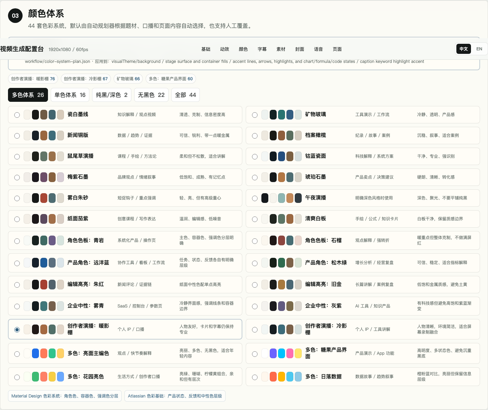 |  |

| Voice, locale, and dialects | Per-page content/design/caption notes |
| --- | --- |
| 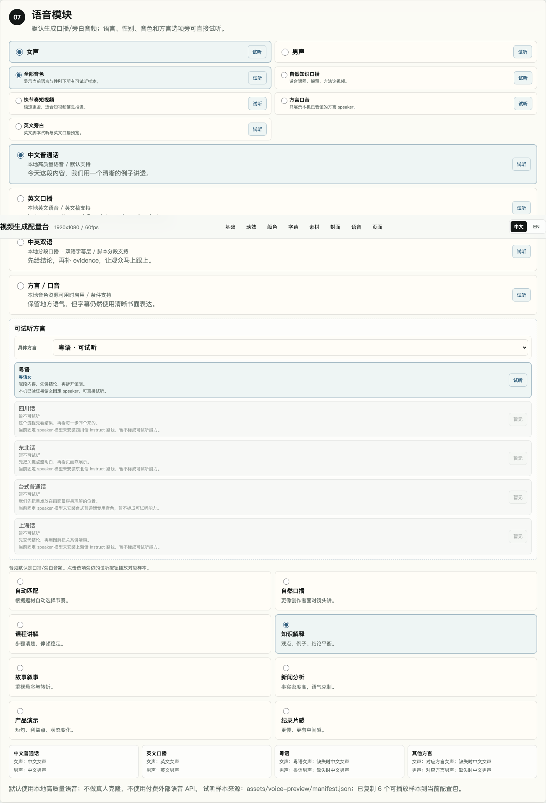 |  |

<details>
<summary><strong>More real console captures: material routing, English catalogs, and horizontal/vertical browsers</strong></summary>

| Material routing | English motion catalog |
| --- | --- |
| 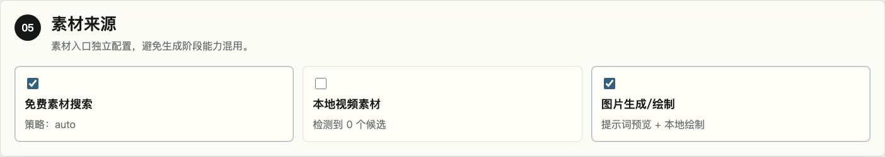 | 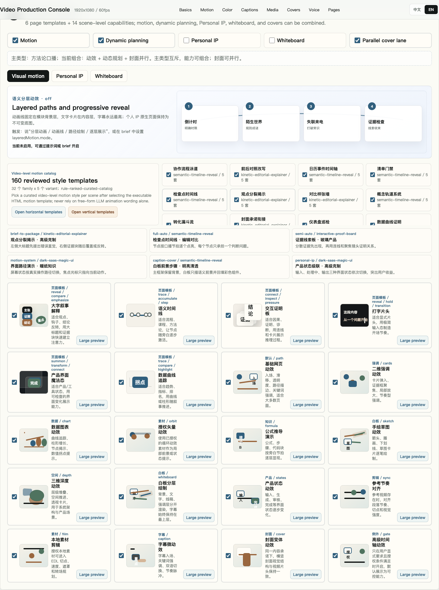 |

| English captions | English cover workbench |
| --- | --- |
| 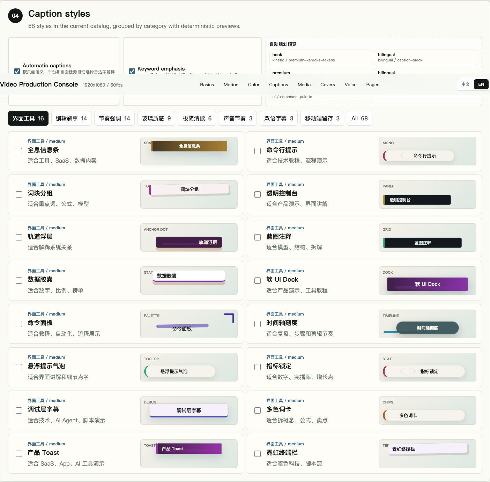 | 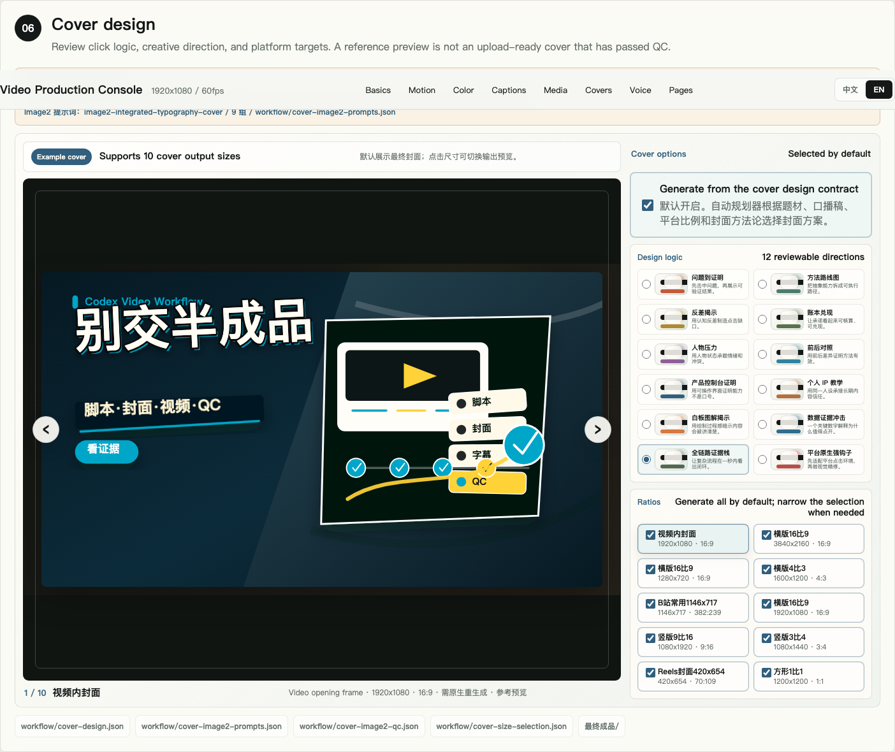 |

| Horizontal motion browser | Vertical motion browser |
| --- | --- |
| 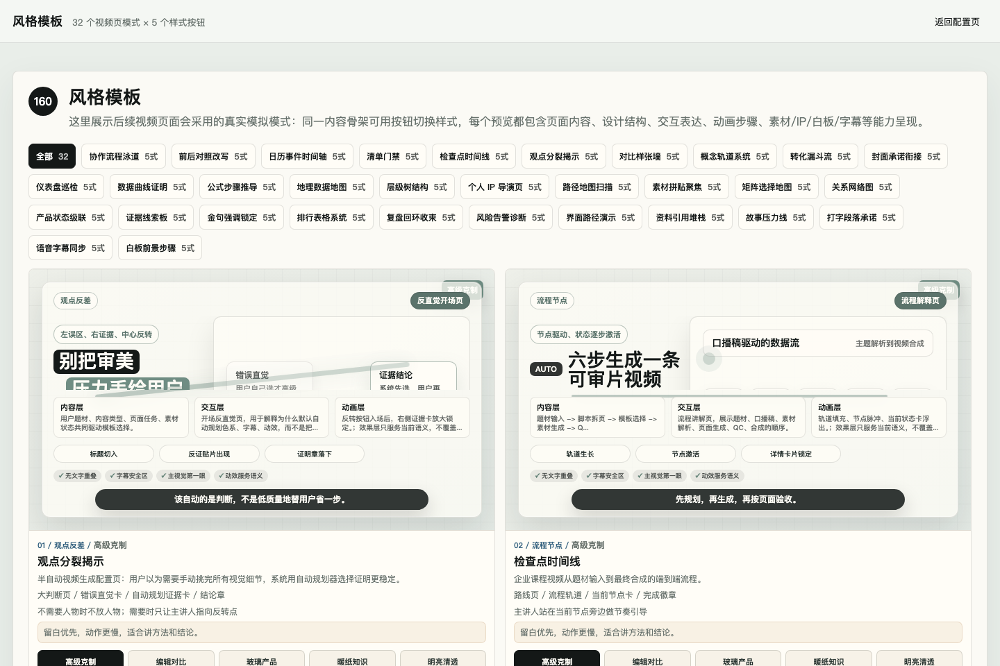 | 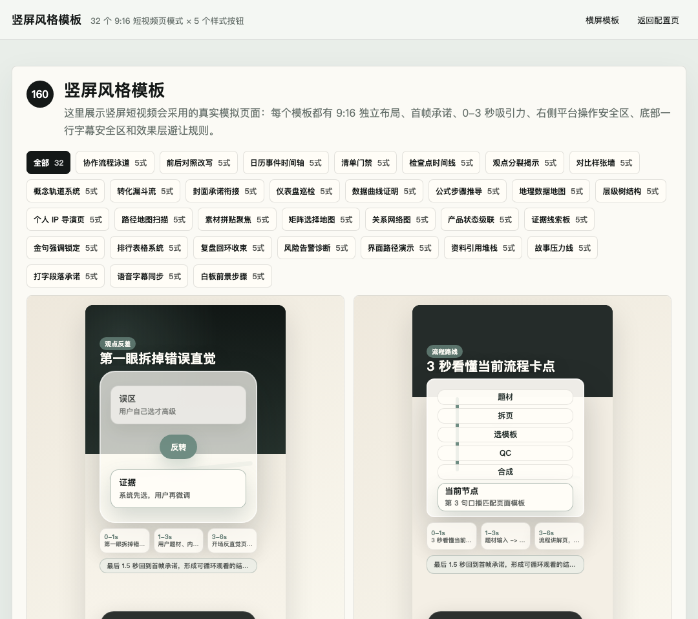 |

</details>

The console covers format, video type, motion, color, captions, local assets, covers, voice, and per-page content/design/caption notes.

## Motion: 32 families × 5 variants

🧭 The catalog exposes **160 reviewable combinations**, plus **6 executable core HTML templates** and **14 scene-level motion capabilities**. It does not claim 160 QC-passed finished videos.

The V2 reel explains the catalog through eight readable examples; the console remains the complete choice surface.

| Semantic-motion examples | Complete Semi Auto catalog |
| --- | --- |
| [](media/showcase/capability-reel-v2/capability-showcase-v2.mp4) | [](media/showcase/core-demo/motion-style-template-review.html) |

<p align="center">
  
  
</p>
<p align="center">
  
  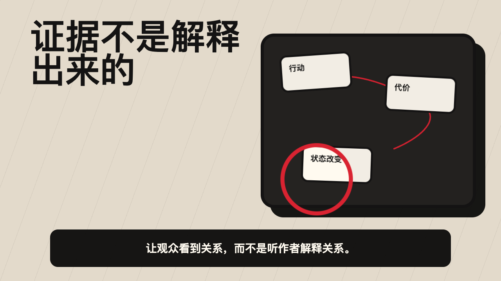
</p>
<p align="center">
  
  
</p>
<p align="center">
  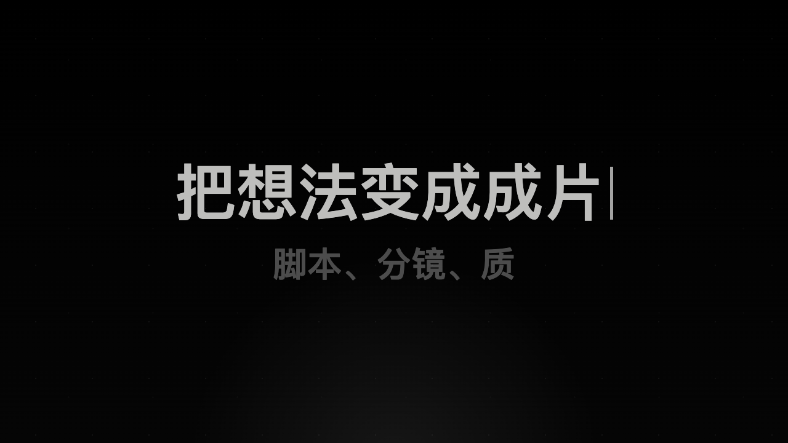
</p>

Motion is selected by meaning—reveal, compare, trace, connect, accumulate, emphasize, transition, chart, path, inspect, derive, edit, caption rhythm, or cover payoff—not by random decoration. Every public example must include readable content, a real or project-owned asset, an object change, an explicit conclusion, caption-safe space, and provenance.

## Captions: 68 styles in 8 design groups

V2 arranges all 68 styles on one “caption museum” plane. All eight districts exist in the overview; the camera focuses one semantic group at a time while the rest recede. A single real narration cue keeps ownership of the bottom safe band.

| All 68 styles on one page | Active semantic district |
| --- | --- |
| 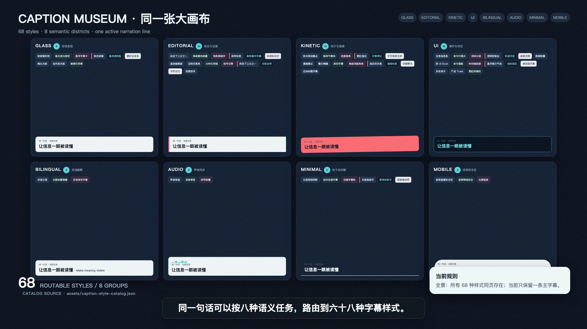 | 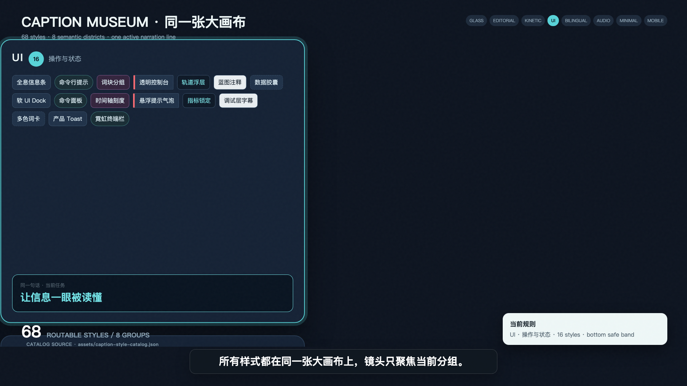 |

[Open the complete selectable caption catalog](media/showcase/core-demo/config-caption-gallery.png)

| Group | Count | Typical use |
| --- | ---: | --- |
| UI | 16 | Product demos, steps, states |
| Editorial | 14 | Claims, evidence, turns, conclusions |
| Kinetic | 14 | Hooks, keywords, short-form rhythm |
| Glass | 9 | Technology and dark-background overlays |
| Minimal | 6 | Documentary, course, low-interference narration |
| Bilingual | 3 | Two-line translation and terminology |
| Audio | 3 | Waveform, word, and beat feedback |
| Mobile | 3 | 9:16 safe areas and large-type reading |

Captions are planned with real speech cues, keyword emphasis, single-line safety, content layers, and target format. They are not an uncoordinated final overlay.

## Covers: 12 click logics × 10 native targets

🧭 The console now renders all **12 cover design logics**, not only a resolution picker.


| Logic | Narrative fit |
| --- | --- |
| Problem to proof | Pain → visible evidence |
| Method roadmap | Steps, tutorials, frameworks |
| Misdirection reveal | Myths and contrarian turns |
| Ledger payoff | Cost, value, and result reviews |
| Character pressure | Decisions and conflict |
| Before/after craft | Transformation and optimization |
| Product console proof | Tools, SaaS, feature demos |
| Creator-IP teaching | Creators, courses, knowledge |
| Whiteboard reveal | Structures, formulas, relations |
| Data evidence shock | Metrics, trends, research |
| Workflow proof stack | Systems and delivery chains |
| Platform-native hook | Feed and short-form first frames |

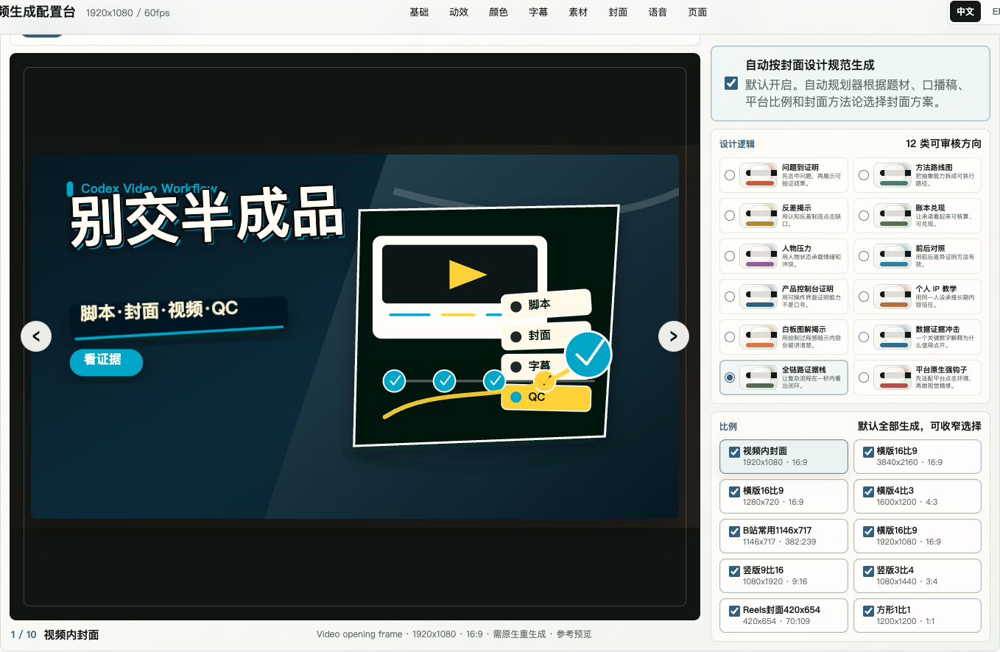

Targets include the in-video 16:9 opening, 4K 16:9, YouTube 1280×720, 4:3, Bilibili formats, 9:16, 3:4, Reels 420×654, and 1:1. Preview artifacts include `cover-master-16x9-3840x2160.svg`; selection is recorded in `workflow/cover-size-selection.json`. Use `--cover-only` for an isolated cover continuation.

> Repository SVGs are review previews. Upload-ready covers require native-ratio bitmaps plus provenance, text, crop-safe-area, and cover-QC checks.

### Committed cover examples

| 16:9 | 9:16 | 1:1 |
| --- | --- | --- |
|  |  |  |

These are separate committed cover examples, not the ten still-pending targets from the new demo.

## Color and visual systems


🧭 The semi-auto console exposes 44 design systems spanning editorial, product UI, whiteboard, mineral glass, archive, creator IP, brand opinion, data news, monochrome, and multicolor work. At the runtime contract layer, the current engine has 10 named palettes plus 10 visual themes. The larger 44-entry configuration catalog is a curated choice surface over those runtime controls, not a claim of 44 independent render engines.

## Personal IP: consistency first, animation isolated

### New two-page native demo

[](media/showcase/personal-ip/demo-v2/personal-ip-two-page-horizontal.mp4)

This 7.05-second horizontal clip was produced as an independent task and edited into the V2 reel. It uses two native pages from a source run whose QC reported `publishingReady`, then joins the Hook and Framework pages with a 0.35-second transition. Video and page hashes, source QC, and the non-likeness boundary are recorded in its [provenance](media/showcase/personal-ip/demo-v2/provenance.json).

### Six-second horizontal and vertical demos

| 16:9 native Personal-IP hand-drawn page | 9:16 native Personal-IP + whiteboard motion |
| --- | --- |
| [](media/showcase/personal-ip/demos/personal-ip-whiteboard-horizontal-6s.mp4) | [](media/showcase/personal-ip/demos/personal-ip-whiteboard-vertical-6s.mp4) |
| 6s · 1920×1080 · native hand-drawn teaching page + deterministic captions | 6s · 1080×1920 · fixed native base + page-local path/node motion + topmost captions |

Both clips are cut from source runs whose delivery QC reported `pass`, `videoPass`, and `publishingReady` as true. The horizontal sample proves the hand-drawn native-page route; its page-local foreground-whiteboard plan was not active. The vertical sample proves the active layered whiteboard route. Both use a generic fallback host and explicitly do **not** claim the user's likeness. See the committed [provenance record](media/showcase/personal-ip/demos/provenance.json).

| Opening | Teaching | Closing |
| --- | --- | --- |
|  |  |  |

- Standard Personal-IP videos use provenance-backed native pages to keep persona, wardrobe, layout, and visual DNA stable.
- “Personal IP + animation” rebuilds semantic layers only when explicitly authorized.
- Missing native-page provenance stops full auto before composition; the workflow does not substitute an approximate HTML persona page and call it final.

### 4.5-second layered whiteboard

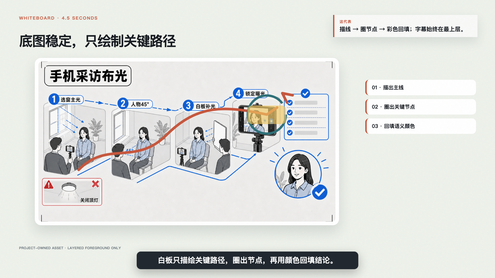

The whiteboard does not redraw the full page. It adds semantic foreground layers over a stable project-owned base: establish, trace the primary path, circle the critical node, add an arrow and semantic fill, then hold for reading. Captions stay topmost and the drawing path avoids faces and the caption-safe band. See the [whiteboard plan](media/showcase/capability-reel-v2/workflow/whiteboard-layered-reveal-plan.json).

## Extensible visual page types


| Strategy guide | Relationship map | Interface plate |
| --- | --- | --- |
|  |  |  |

Bundled routes cover knowledge encyclopedia, strategy guide, relationship map, collection atlas, editorial hook, surreal carrier, oriental ink, interface plate, and progression collage. Each page still passes provenance, readability, and visual QC before final-video use.

## Core Skills

| Skill | Role | Owns |
| --- | --- | --- |
| `codex-video-workflow` | **Main production engine** | Brief, script, retention, routing, local voice, captions, render, QC, and package |
| `codex-video-cover-generation` | **Independent cover engine** | Click logic, platform ratio, Image2 requests, ingestion, provenance, and cover QC |
| `build-*` visual modules | **Specialized page routing** | Knowledge, strategy, relationships, atlas, editorial, abstract, ink, UI, and progression scenes |

The main and cover Skills enforce local/global version parity. Restart Codex after installation so the catalog reloads.

## Evidence-backed delivery package

```text
<output>/
├── delivery.html
├── <title>.mp4
├── delivery-manifest.json
├── script/
│   ├── narration.txt
│   ├── narration-spoken.txt
│   ├── storyboard.md
│   └── subtitles.srt
├── workflow/
│   ├── generation-mode-contract.json
│   ├── presentation-route-lock.json
│   ├── page-decision-contract.json
│   ├── voice-subtitle-manifest.json
│   ├── caption-style-plan.json
│   ├── cover-design.json
│   ├── cover-size-selection.json
│   └── quality-scorecard.md
├── cover/
├── 最终成品/
└── logs/
    ├── ffprobe.json
    ├── blackdetect.log
    ├── silencedetect.log
    ├── volumedetect.log
    └── qc.json
```

## Install and verify

```bash
export CODEX_HOME="${CODEX_HOME:-$HOME/.codex}"
mkdir -p "$CODEX_HOME/skills/codex-video-workflow"
rsync -a --exclude '.git/' --exclude 'research/' --exclude 'output/' ./ \
  "$CODEX_HOME/skills/codex-video-workflow/"

for skill_name in \
  codex-video-cover-generation \
  build-collection-atlas build-editorial-hook build-interface-plate \
  build-knowledge-encyclopedia build-oriental-ink build-progression-collage \
  build-relationship-map build-strategy-guide build-surreal-carrier; do
  skill_dir="skills/$skill_name"
  [ -f "$skill_dir/SKILL.md" ] || continue
  mkdir -p "$CODEX_HOME/skills/$skill_name"
  rsync -a "$skill_dir/" "$CODEX_HOME/skills/$skill_name/"
done

node --check scripts/poc-video-workflow.mjs
node --check scripts/build-semi-auto-config-html.mjs
node scripts/self-test-generation-mode-default.mjs
node scripts/validate-cover-targets.mjs
node scripts/validate-html-motion-templates.mjs
```

## Release boundary

- A successful render is not publishing readiness; covers, provenance, caption safety, and QC must all converge.
- Catalog previews, dry-run SVGs, and planning files do not replace native bitmaps, runtime pixels, or human visual review.
- The 68-style caption catalog is present, but the current caption strategy routing regression still has six failing cases; do not describe automatic scene-to-caption routing as fully green yet.
- The repository currently has no root license file. Maintainers should choose and add an explicit `LICENSE` before public reuse or redistribution.

## References

- [Generation modes](references/generation-modes.md)
- [Quality gates](references/quality-gates.md)
- [Cover lifecycle](references/cover-generation-workflow.md)
- [Cover design method](references/cover-design.md)
- [Visual-series routing](references/gpt-image-2-visual-series.md)
- [Showcase provenance](media/showcase/README.md)
