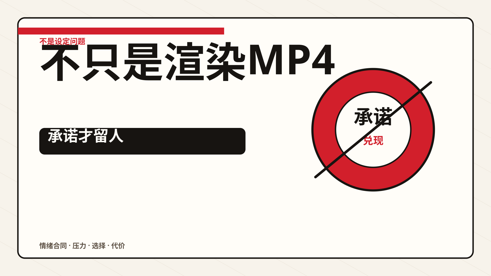
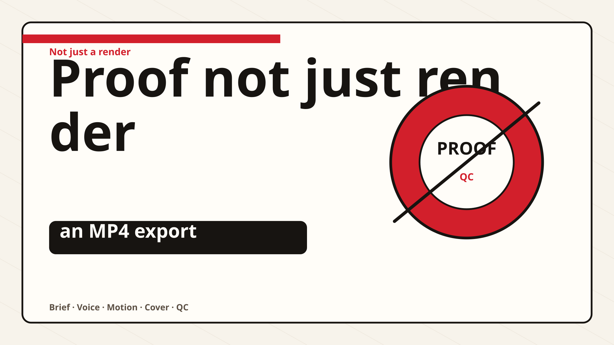

# Codex Video Workflow Skill

[English](README.md) | 简体中文

从一份 brief 生成可审查的口播视频：先产出口播脚本，再生成视频，最后留下可验证证据。

`codex-video-workflow` 是一个本地 Codex Skill，用于规划、渲染并验证版权安全的讲解、产品、教程和口播系列视频。它不把视频生成当作一次黑盒渲染，而是把口播材料、声音方向、视觉系统、动效计划、封面包、字幕、截图和 QC 报告都产出为可检查的文件。

## Demo

打开中英文播放器：

[启动中文 / 英文 Demo 页面](media/demo.html)

打开视觉特效能力展示：

[启动 Galacean 风格视觉特效展示页](media/galacean-vfx-showcase.html)

| 中文口播版 | 英文口播版 |
| --- | --- |
| [](media/codex-video-workflow-zh.mp4) | [](media/codex-video-workflow-en.mp4) |
| 本地授权中文语音工作流，74 秒，1080p。 | 同一套本地语音工作流，使用英文 CosyVoice speaker，86 秒，1080p。 |

GitHub README 在不同上下文中对已提交 MP4 的渲染方式可能不同。上方封面图会直接链接到 MP4 文件；`media/demo.html` 提供本地或托管浏览时可用的语言切换播放器。

Demo 的验证证据包含 [`media/qc/codex-video-workflow-zh-qc.json`](media/qc/codex-video-workflow-zh-qc.json) 和 [`media/qc/codex-video-workflow-en-qc.json`](media/qc/codex-video-workflow-en-qc.json)。

## 能做什么

- **先口播后渲染**：在生成视频之前，先写出口播脚本和适合 TTS 的 spoken text。
- **口播停顿策略**：把逗号类标点保留为短句内停顿，只在完整句子或语义节拍后插入换行。
- **内容呈现设计**：渲染前先选择视觉系统、美术 brief、动效模板和场景隐喻。
- **本地语音路径**：支持本地 CosyVoice 和 MeloTTS，用于中英文最终质量的授权口播生成。
- **HTML 动效渲染**：优先使用本地 `html-video` renderer；不可用时走 FFmpeg fallback，并把 fallback 记录到日志中。
- **Remotion 风格动效 primitive**：借用 Remotion 的帧驱动时序、easing、转场时长核算和文字动效规则，让 `html-video` 场景更有动效，但不默认替换 renderer。
- **图片提示词清单**：可写出 GPT Image 2 兼容的提示词，消费 Codex 内置 `image_gen` 生成的位图资产，或记录待生成的本地审阅资产。
- **封面包**：默认走 Codex/Cos X 内置 Image 2 / `image_gen` 的一体化文字封面路线。标题、副标题、badge、主体、光影和材质应一起生成在封面位图里；OpenAI Images API 只保留为显式直连选项，不是默认封面路径。
- **个人 IP 图解路线**：可在明确个人 IP、creator persona、知识卡、Agent 协作图、PPT/课程/直播教学 brief 中启用 `ip-diagram-creator` 风格规划，同时避免普通 tutorial/explainer 被误改成同一种 house style。
- **视频工具融合**：可借用 Video-Use、FFmpeg、HyperFrames、Remotion、Manim/D3、reference-video QC 等外部能力，但脚本、时序、声音、封面、渲染、包装和 QC 仍由本 skill 统一治理。
- **视觉特效层**：可把 Galacean/effects-runtime 风格的粒子、烟花、能量光束、扫描、2D/3D 点缀和转场爆发纳入“视觉动效”体系，作为可选场景层使用。特效必须有明确语义任务、安全位置、资产授权、fallback，以及截图/motion QC 证据。
- **白板 layered reveal**：支持在现有设计背景上叠加 marker/手绘前景揭示，字幕和 caption 始终保持最上层。
- **免费商用兼容素材引擎**：可根据口播稿或视频素材稿拆分场景查询，从本地授权素材、直接 URL、NASA、Pexels、Pixabay 或本地 fixture 中获取并标准化 B-roll，输出来源/授权/哈希账本，再把素材作为视频画面的一部分融入场景。
- **增量修复**：可在已生成包上只修某个场景窗口，并输出 lineage、耗时、截图、解码检查和增量 QC 证据。
- **QC 证据**：输出最终 MP4、截图、字幕、manifest、FFprobe 数据、黑帧检查、音量检查和 `logs/qc.json`。
- **最终响度归一化**：把交付 MP4 的口播音量提升到清晰可听的播放水平，并在 `workflow/final-audio-normalization.json` 记录滤镜链。

## 快速开始

安装到 Codex 的全局 skill 文件夹：

```bash
mkdir -p ~/.codex/skills
rsync -a .agents/skills/codex-video-workflow ~/.codex/skills/
```

或者安装到某个工作区的本地 skill 文件夹：

```bash
mkdir -p /path/to/project/.agents/skills
rsync -a .agents/skills/codex-video-workflow /path/to/project/.agents/skills/
```

复制完成后重启 Codex，让 skill 列表刷新。

## 环境要求

必需：

- Node.js 18+
- FFmpeg / FFprobe
- 用于生产口播的本地 CosyVoice 或 MeloTTS 工作区

可选：

- 本地 `html-video` clone/build，路径为 `research/html-video-research/html-video/packages/cli/dist/index.js`
- macOS `say`，仅用于明确降级的 smoke check
- macOS Quick Look（`qlmanage`），用于 FFmpeg fallback 卡片路径
- 仅直接调用 API 路径 `--image-source image2` 时需要 `OPENAI_API_KEY`；Codex 内置 `image_gen` 资产不需要。
- 免费素材 API key：`PEXELS_API_KEY`、`PIXABAY_API_KEY` 只在启用对应 provider 时需要；`nasa` provider 不需要 key；`fixture` 只用于本地 demo/smoke，不代表可发布外部素材。
- Galacean/effects-runtime package 以及项目自制或明确授权的特效 JSON、纹理、模型资产，仅在启用视觉特效层时需要。runtime 可用不等于第三方特效素材可发布。

默认场景图片路径是 `image2-dryrun`：它会写出 GPT Image 2 兼容提示词，不会调用 OpenAI API。封面单独处理：正常最终质量封面路径是 Codex/Cos X 内置 Image 2 / `image_gen`，通过 `--image-source codex-builtin --codex-image-assets-dir <dir>` 绑定到项目包里。先在 Codex App 里生成完整带字封面，保存到项目目录，再交给 workflow 做尺寸、证据、QC 和交付整理；文件名包含 `cover`、`thumbnail`、`封面`、`海报`、`integrated`、`typography`、`final`、`完整`、`成品` 或 `带字` 的图片会优先被选为完整封面资产。

运行默认值统一放在 `assets/runtime-defaults.json`。每次生成都会写出 `workflow/runtime-config.json`，记录最终解析出的图片、语音、素材、封面和帧数策略。命令行参数和 brief 字段可以显式覆盖默认值，但 `OPENAI_API_KEY` 这类环境能力只代表可用凭证，不会静默把默认 `image2-dryrun` 改成真实 API 调用。

## 验证安装

在目标工作区运行：

```bash
node --check .agents/skills/codex-video-workflow/scripts/poc-video-workflow.mjs
node --check .agents/skills/codex-video-workflow/scripts/self-test-full-framework.mjs
node .agents/skills/codex-video-workflow/scripts/validate-voice-pause-policy.mjs
node .agents/skills/codex-video-workflow/scripts/validate-cover-targets.mjs
node .agents/skills/codex-video-workflow/scripts/self-test-capability-routing.mjs --out-root /tmp/codex-video-workflow-capability-routing
node .agents/skills/codex-video-workflow/scripts/self-test-full-framework.mjs --out-root /tmp/codex-video-workflow-full-framework
python3 ~/.codex/skills/.system/skill-creator/scripts/quick_validate.py .agents/skills/codex-video-workflow
```

## Smoke Test

```bash
node .agents/skills/codex-video-workflow/scripts/poc-video-workflow.mjs \
  --brief .agents/skills/codex-video-workflow/assets/examples/authorized-brief.json \
  --out research/codex-video-workflow-poc/install-smoke \
  --mode recommended \
  --duration 30 \
  --voice-backend melotts_local \
  --speech-style conversational \
  --image-source image2-dryrun
```

只生成提示词/审阅版封面包，不绑定已生成封面资产：

```bash
node .agents/skills/codex-video-workflow/scripts/poc-video-workflow.mjs \
  --brief .agents/skills/codex-video-workflow/assets/examples/authorized-brief.json \
  --out research/codex-video-workflow-poc/cover-only \
  --cover-only \
  --speech-style conversational \
  --image-source image2-dryrun
```

使用 Codex/Cos X 内置 Image 2 资产生成最终质量封面包：

```bash
node .agents/skills/codex-video-workflow/scripts/poc-video-workflow.mjs \
  --brief .agents/skills/codex-video-workflow/assets/examples/authorized-brief.json \
  --out research/codex-video-workflow-poc/cover-only-codex-image2 \
  --cover-only \
  --speech-style conversational \
  --image-source codex-builtin \
  --codex-image-assets-dir research/codex-video-workflow-inputs/codex-image2-covers
```

资产目录里应放入 Codex/Cos X Image 2 已生成并保存到项目内的封面图，最好是原生目标比例文件，例如 `horizontal-16x9-integrated-cover.png`、`horizontal-4x3-integrated-cover.png`、`vertical-9x16-integrated-cover.png`、`vertical-3x4-integrated-cover.png`、`reels-420x654-integrated-cover.png`、`square-1x1-integrated-cover.png`。

使用同一套本地语音工作流生成英文 Demo：

```bash
node .agents/skills/codex-video-workflow/scripts/poc-video-workflow.mjs \
  --brief .agents/skills/codex-video-workflow/media/oral-materials/skill-capability-brief-en.json \
  --out research/codex-video-workflow-promo/runs/skill-capability-oral-series-en \
  --mode recommended \
  --voice-backend auto \
  --speech-style conversational \
  --image-source image2-dryrun
```

启用免费素材引擎的本地 demo：

```bash
node .agents/skills/codex-video-workflow/scripts/poc-video-workflow.mjs \
  --brief .agents/skills/codex-video-workflow/assets/examples/free-stock-material-demo-brief.json \
  --out research/codex-video-workflow-poc/free-stock-material-video-demo \
  --mode recommended \
  --voice-backend melotts_local \
  --image-source local \
  --free-stock-engine \
  --free-stock-provider-order fixture \
  --allow-free-stock-fixture \
  --no-open-delivery-page
```

真实发布素材建议使用 `local-authorized,direct-url,nasa,pexels,pixabay` provider，并保留人工授权复核。`fixture` 会生成本地测试片段，只用于验证引擎链路和版式 QC。

增量场景修复 / 融合导出：

```bash
node .agents/skills/codex-video-workflow/scripts/incremental-video-edit.mjs \
  --base research/codex-video-workflow-poc/authorized-video \
  --out research/codex-video-workflow-poc/authorized-video-revision-01 \
  --scene-id product-ui \
  --label "review patch: product-ui visual element" \
  --force
```

当一个视频包已经通过完整流程，并且本次只修改某个场景里的视觉元素，同时口播、字幕文本、cue 时长和音乐时序都不变时，使用这条路径。它会复制 base 包，保留 `renders/final.base.mp4`，只在目标场景时间窗里修改画面，复用 Planner、TTS、音频和非目标场景，最后融合导出新的 `renders/final.mp4`。如果修改会影响口播文本、cue 时长、场景边界、声音设置或权利敏感素材，就必须重建受影响节点及其下游同步/QC，不能声称全量复用。

## 输出证据

典型输出包括：

- `final.mp4`
- `<当前视频标题>.mp4`
- `workflow/aesthetic-brief.json`
- `workflow/aesthetic-quality-rubric.md`
- `workflow/content-presentation-design.json`
- `workflow/caption-style-plan.json`
- `workflow/motion-template-selection.json`
- `workflow/motion-grammar-plan.json`
- `workflow/voice-direction.json`
- `workflow/cover-design.json`
- `workflow/cover-image2-prompts.json`
- `workflow/cover-image2-qc.json`
- `workflow/cover-size-selection.json`
- `cover/cover-video-opening-16x9.svg`
- `cover/cover-master-16x9-3840x2160.svg`
- `cover/cover-16x9-1920x1080.svg`
- `cover/cover-16x9-1280x720.svg`
- `cover/cover-bilibili-1146x717.svg`
- `cover/cover-vertical-1080x1920.svg`
- `cover/cover-vertical-profile-1080x1440.svg`
- `cover/cover-instagram-reels-420x654.svg`
- `cover/cover-square-1200x1200.svg`
- 每个主题自己的 `最终成品/` 上传封面目录；该目录按中文比例/平台分组，并且只放原生目标比例 Image 2/Codex 终版
- 可选的 `封面预览-非上传终版/`；仅用于还没有原生目标比例 Image 2/Codex 封面资产时查看本地目标比例重排预览，不能作为上传终版
- `script/narration.txt`
- `script/narration-spoken.txt`
- `workflow/design-plan.json`
- `workflow/image-generation-strategy.json`
- `workflow/image2-prompts.json`
- `workflow/visual-asset-manifest.json`
- `workflow/visual-relevance-audit.json`
- `workflow/visual-rhythm-plan.json`
- `workflow/external-capability-fusion-plan.json`
- 启用 Galacean 视觉特效时，还会输出 `workflow/galacean-effects-plan.json`
- 启用白板 layered reveal 时，还会输出 `workflow/whiteboard-layered-reveal-plan.json`
- 启用个人 IP / 教学图解路线时，还会输出 `workflow/ip-diagram-creator-plan.json`、`workflow/ip-diagram-creator-native-jobs.json` 和 `workflow/ip-diagram-layout-audit.json`
- 当启用免费素材引擎时，还会输出 `workflow/free-stock-material-plan.json`、`workflow/free-stock-asset-ledger.json`、`materials/free-stock/raw/*` 和 `assets/free-stock/*.mp4`
- 当 brief 提供授权原始素材时，还会输出 `workflow/raw-footage-inventory.json`、`workflow/raw-transcript-index.json`、`workflow/takes-packed.md`、`workflow/word-boundary-map.json`、`workflow/edit-decision-list.json`、`workflow/cut-boundary-qc.json` 和 `workflow/source-media-normalization-plan.json`
- `workflow/voice-subtitle-manifest.json`
- `workflow/final-audio-normalization.json`
- `logs/qc.json`
- `screenshots/frame-*.png`
- 增量修复包还必须包含 `workflow/incremental-edit-lineage.json`、`workflow/incremental-timing-summary.json`、`logs/incremental-qc.json`、`logs/incremental-ffprobe.json`、`logs/incremental-blackdetect.log`、`logs/incremental-volumedetect.log`、`screenshots/incremental-base-target-scene.png` 和 `screenshots/incremental-patched-target-scene.png`

只有当视频/音频元数据、本地语音合规性、口播停顿策略、默认直接进入第一幕且 0 秒开始口播、最终 MP4 响度、一个主设计多分辨率封面证据、封面标题来源、封面 Image 2 主提示词、PNG/JPG 字节大小证据、按标题命名的根目录 MP4、主题内 `最终成品/` 原生目标比例封面拷贝、美术规划、高级字幕样式计划、HTML 动效模板选择、Remotion 风格帧驱动动效 primitive、图片生成策略、图片提示词清单、口播语义绑定的视觉相关性证据、视觉节奏密度证据、插入视觉、单行顺序字幕显示、截图和黑帧检查都齐全时，QC 才会通过。启用 Galacean 视觉特效时，还必须有 `workflow/galacean-effects-plan.json`、已选择/已拒绝特效决策、资产授权、字幕安全层级、确定性文字所有权、fallback，以及特效前/峰值/后的截图证据。增量修复还要求 `logs/incremental-qc.json` 通过：时长漂移不超过 `0.2s`，目标场景前后截图哈希发生变化，blackdetect 干净，base 有音频时必须保留并保持可听，码率仍达到交付质量；只复制旧的完整流程 `logs/qc.json` 不能证明本次修复通过。如果启用原始素材剪辑，还必须通过 Video-Use-style 合同：素材 inventory、转写索引、packed transcript 阅读面、词边界图、EDL、切点自检和素材 normalization 计划。云端 ASR 只能显式 opt-in，不能作为默认依赖。

修改动效模板后运行：

```bash
node .agents/skills/codex-video-workflow/scripts/validate-html-motion-templates.mjs
```

修改口播停顿逻辑后运行：

```bash
node .agents/skills/codex-video-workflow/scripts/validate-voice-pause-policy.mjs
```

修改封面尺寸目标后运行：

```bash
node .agents/skills/codex-video-workflow/scripts/validate-cover-targets.mjs
```

修改字幕时序、视觉换行或封面标题逻辑后，对生成包运行：

```bash
node .agents/skills/codex-video-workflow/scripts/validate-subtitle-cover-contract.mjs \
  --out research/codex-video-workflow-poc/authorized-video \
  --brief .agents/skills/codex-video-workflow/assets/examples/authorized-brief.json
```

完成增量场景修复后，运行解码检查和包合同验证：

```bash
ffmpeg -v error -i research/codex-video-workflow-poc/authorized-video-revision-01/renders/final.mp4 -f null -
node .agents/skills/codex-video-workflow/scripts/validate-subtitle-cover-contract.mjs \
  --out research/codex-video-workflow-poc/authorized-video-revision-01 \
  --brief research/codex-video-workflow-poc/authorized-video-revision-01/brief.json
```

修改原始素材 / Video-Use-style 路由后运行：

```bash
node .agents/skills/codex-video-workflow/scripts/validate-raw-footage-editing-contract.mjs \
  --out research/codex-video-workflow-poc/authorized-video \
  --brief .agents/skills/codex-video-workflow/assets/examples/authorized-brief.json
```

## 运行参数

语音：

```bash
--voice-backend auto
--voice-backend cosyvoice_local
--voice-backend melotts_local
--voice-backend say
--allow-say-fallback
--provided-audio path/to/audio.wav
--provided-audio-trim-start 4
--provided-audio-trim-end 2
```

提供音频时，流程必须把该文件作为口播源：复制到视频包内，按 `--provided-audio-trim-start` / `--provided-audio-trim-end` 裁剪，进入统一响度和动态处理链，并在 `workflow/voice-subtitle-manifest.json` 记录 `voiceBackend: "provided_audio"` 与 `providedAudio.authorizedByUser: true`。这时不会重新生成 TTS，最终视频时长以提供音频裁剪后的真实时长为准。

未提供音频时，流程才使用 skill 自身语音能力生成口播。默认 `--voice-backend auto` 会先尝试本地 CosyVoice，再尝试本地 MeloTTS；显式指定 `cosyvoice_local` 或 `melotts_local` 时只走对应本地后端。

`say` 或 `--allow-say-fallback` 只应该用于明确降级的 smoke check。任何语言的最终质量视频都应该使用 CosyVoice 或 MeloTTS。

MeloTTS 中文会在 TTS 前加载 `assets/chinese-polyphone-phrases.json` 作为多音词短语读音表，并把词典版本写入 `workflow/chinese-polyphone-lexicon.json` 和 `workflow/voice-subtitle-manifest.json`；可以用 `CHINESE_POLYPHONE_LEXICON=/path/to/file.json` 覆盖默认词典。

口播风格：

```bash
--speech-style auto
--speech-style conversational
--speech-style tutorial
--speech-style explainer
--speech-style story
--speech-style news
--speech-style product
--speech-style documentary
```

`conversational` 只在完整句子或语义节拍后加入 TTS 停顿提示。逗号类标点（`，`、`,`、`、`）保留为短句内停顿；如果插入显式时长，使用 `0.5s`；句末标点仍使用后端默认停顿。原始口播文本保存在 `script/narration.txt`，适合 TTS 的版本写入 `script/narration-spoken.txt`。

只生成封面：

```bash
--cover-only
```

该参数会写出 `workflow/cover-design.json`、`cover/cover-video-opening-16x9.svg` 和独立分辨率导出，不生成音频，也不渲染 MP4。独立封面使用同一个主封面概念重排到常见尺寸；视频开场封面资产必须匹配最终视频画幅，但默认 MP4 会直接从第一幕开始，只有传入 `--opening-cover` 或 `--cover-intro-seconds` 才把封面渲染进视频。
正常封面包会在 `workflow/cover-design.json` 中记录 `defaultCoverEngine: "image2-integrated-typography-cover"`。旧的标题卡/promise-seal SVG 设计，以及“主体图 + 本地叠字”路径，都是审稿兜底，不再是默认最终质量路径。

图片：

```bash
--image-source image2-dryrun
--image-source local
--image-source codex-builtin --codex-image-assets-dir <dir>
--image-source image2
```

`--image-source codex-builtin` 消费 Codex/Cos X 内置 `image_gen` 生成并保存到项目内的图片，不需要 `OPENAI_API_KEY`。封面图建议命名为 `horizontal-16x9-integrated-cover.png`、`horizontal-4x3-integrated-cover.png`、`vertical-9x16-integrated-cover.png`、`vertical-3x4-integrated-cover.png`、`square-1x1-integrated-cover.png`、`封面-完整.png` 或 `海报-带字.png` 并放入 `--codex-image-assets-dir`。`--image-source image2` 会调用 OpenAI Images API，需要 `OPENAI_API_KEY`；它不是默认封面路径。场景字幕、声明和 logo 应保持为确定性的 HTML/SVG overlay；封面主标题、副标题和 badge 则应一体化生成在 Image 2/Codex 封面位图里。

补齐缺失的封面目标比例时，不允许用本地绘制图冒充最终成品。`4:3`、`3:4`、`1:1`、Reels、B 站 1146x717 等缺失项应保持 `needs-native-target-ratio-image2`，直到拿到真实 Codex/Image2 原生目标比例位图。Codex App 默认路线是先用内置 Image 2 / `image_gen` 生成缺失比例，再执行 `scripts/ingest-codex-image2-cover-target.mjs --topic <topic-dir> --target <target-id> --source <codex-imagegen-png>` 写入目标尺寸、更新 `fulfilledNativeTargetRatioExports` 并标记 `uploadReady: true`。显式 API 备选才是 `scripts/generate-cover-targets-image2.mjs --root <batch-root-or-topic-root>`，需要 `OPENAI_API_KEY`；没有真实 Image2/Codex 图时必须继续 pending，避免生成假最终图。

免费素材：

```bash
--free-stock-engine
--free-stock-provider-order local-authorized,direct-url,nasa,pexels,pixabay
--allow-free-stock-fixture
```

引擎会从 brief 的 `scenes[].stockQuery`、`scenes[].visualPrompt`、标题、正文和口播中生成查询计划。`local-authorized` 和 `direct-url` 要求 brief 明确写入授权/来源元数据；`pexels` 和 `pixabay` 需要对应环境变量；`nasa` 会记录公共领域/权利复核提示；`fixture` 仅用于本地测试。

## Skill 结构

```text
codex-video-workflow/
├── SKILL.md
├── README.md
├── README.zh-CN.md
├── agents/openai.yaml
├── assets/examples/authorized-brief.json
├── assets/examples/free-stock-material-demo-brief.json
├── assets/galacean-effects-capability-catalog.json
├── media/
│   ├── demo.html
│   ├── galacean-vfx-showcase.html
│   ├── codex-video-workflow-zh.mp4
│   ├── codex-video-workflow-zh-cover.svg
│   ├── codex-video-workflow-en.mp4
│   ├── codex-video-workflow-en-cover.svg
│   ├── oral-materials/
│   │   ├── skill-capability-brief-zh.json
│   │   ├── skill-capability-oral-series-zh.md
│   │   ├── skill-capability-brief-en.json
│   │   └── skill-capability-oral-series-en.md
│   └── qc/
│       ├── codex-video-workflow-zh-qc.json
│       └── codex-video-workflow-en-qc.json
├── references/
│   ├── aesthetic-system.md
│   ├── candidate-matrix.md
│   ├── content-presentation-design.md
│   ├── cover-design.md
│   ├── external-capability-fusion.md
│   ├── galacean-visual-effects.md
│   ├── design-templates.md
│   ├── failure-cases.md
│   ├── html-motion-platforms.md
│   ├── image-generation-routing.md
│   ├── integration-roadmap.md
│   ├── ip-diagram-creator-integration.md
│   ├── methodology.md
│   ├── motion-usage-playbook.md
│   ├── plugin-routing.md
│   ├── quality-gates.md
│   ├── research-sources.md
│   ├── whiteboard-layered-reveal.md
│   └── voice-direction.md
├── scripts/poc-video-workflow.mjs
├── scripts/incremental-video-edit.mjs
├── scripts/free-stock-material-engine.mjs
├── scripts/render-ip-diagram-native-pages.mjs
├── scripts/self-test-capability-routing.mjs
├── scripts/self-test-full-framework.mjs
├── scripts/validate-html-motion-templates.mjs
├── scripts/validate-cover-targets.mjs
├── scripts/validate-cover-image2-qc.mjs
├── scripts/validate-plugin-routing-contract.mjs
├── scripts/validate-planner-media-routing.mjs
├── scripts/validate-subtitle-cover-contract.mjs
├── scripts/validate-voice-pause-policy.mjs
└── templates/html-motion/
    ├── motion-template-registry.json
    ├── kinetic-editorial-explainer.html
    ├── semantic-timeline-reveal.html
    └── interactive-proof-board.html
```

## 权利与安全

- 不克隆真人声音。
- 不复制创作者资产。
- 默认不使用商业素材库。
- 免费素材必须留下来源、授权、归因、哈希和发布复核状态；demo fixture 不能当作外部素材发布。
- 不使用未授权音乐。
- 本地渲染不需要上传私有材料。
- 平台发布前仍需要人工审查授权、AI 标识、平台政策和编辑质量。

## 开源与引用说明

这个 skill 围绕本地、可检查的工具链和参考资料构建：

- [FFmpeg](https://ffmpeg.org/) 和 FFprobe：用于媒体检查、muxing、fallback 渲染和音频检查。
- [FunAudioLLM CosyVoice](https://github.com/FunAudioLLM/CosyVoice) 和 [MeloTTS](https://github.com/myshell-ai/MeloTTS)：在已安装且已授权的前提下，作为本地语音后端选项。
- `html-video`：当工作区内存在本地 clone/build 时，作为优先使用的 HTML 动效渲染器。
- [GitHub README 文档](https://docs.github.com/en/repositories/managing-your-repositorys-settings-and-features/customizing-your-repository/about-readmes)：尤其是 README 中相对链接和图片的处理方式。
- 来自 [awesome-readme](https://github.com/matiassingers/awesome-readme) 和 [Best-README-Template](https://github.com/othneildrew/Best-README-Template) 等项目的公开 README 惯例：尽早展示 demo，安装步骤保持可复制，并把致谢/引用放在文档末尾。
