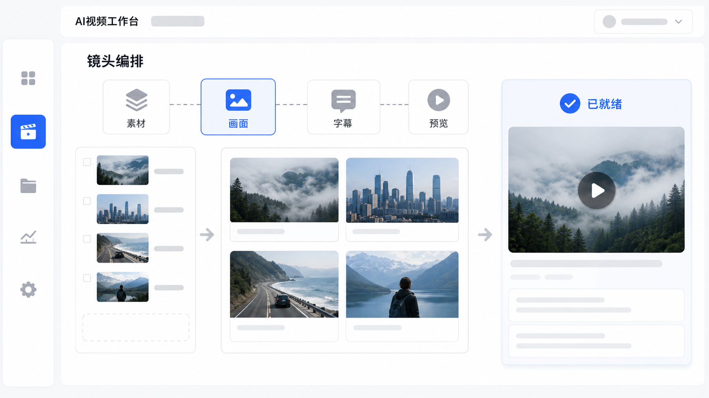

# Codex Video Workflow

<p align="center">
  <a href="README.md">English</a> · <strong>简体中文</strong>
</p>

<p align="center">
  
</p>

<h2 align="center">把一份 Brief 变成可审阅的视频生产包</h2>

<p align="center">
  Codex Video Workflow 是一套本地优先的 AI 视频生产框架，覆盖内容结构、视觉方向、语音与字幕同步、
  语义动效、个人 IP 与手绘白板页面、平台原生封面、质量检查和交付整理。<br>
  每个阶段都会留下可检查、可修复、可复用的输出。
</p>

<p align="center">
  <a href="#如何工作"><strong>如何工作</strong></a> ·
  <a href="#核心能力"><strong>查看核心能力</strong></a> ·
  <a href="#快速开始"><strong>快速开始</strong></a> ·
  <a href="#configuration"><strong>双语配置台</strong></a>
</p>

---

## 框架覆盖什么

输入可以是一份 Brief、文章、口播稿、课程内容或已有素材。框架会把它们整理进同一份生产上下文，而不是生成一堆彼此无关的文件。

| 内容理解 | 视频生产 | 使用方式 | 交付结果 |
| --- | --- | --- | --- |
| 受众、观点、证据、步骤与结论 | 视觉页面、语音时序、字幕、动效、素材与封面 | 全自动，或配置与审阅 | MP4 成片、平台封面、脚本、审阅页与制作记录 |

适用于知识讲解、创作者与个人 IP 内容、手绘白板、产品演示、编辑叙事、数据故事、竖屏短视频和可复用视觉系列。

<a id="如何工作"></a>

## 如何工作

<p align="center">
  
</p>

两种模式共享同一套内容、时序、视觉和交付合同：

- **全自动**：从清晰 Brief 开始，自动规划、生产、检查并整理交付包。
- **配置与审阅**：先打开中英双语配置台和逐页审阅，再进入最终合成。
- **统一生产上下文**：页面决定、语音时序、字幕、素材、封面和审阅证据保持关联，局部修改不必推倒重来。

## 你会得到什么

| 结果 | 用途 |
| --- | --- |
| MP4 成片 | 直接审阅、继续剪辑或进入发布流程 |
| 原生比例平台封面 | 分别适配横屏播放器、竖屏信息流、列表卡片和个人主页 |
| 口播稿、分镜与字幕 | 复核文案和时序，或交给其他编辑继续处理 |
| `delivery.html` | 在一个页面中查看成片、封面、文案与相关素材 |
| 结构化制作记录 | 追踪关键决定、复用已通过内容、定点修复某个阶段 |

<a id="核心能力"></a>

## 核心能力

### 把内容变成视觉系统

框架先识别受众、核心观点、步骤、证据、反差和结论，再选择视觉表达。每一页都围绕一个明确的信息任务设计，而不是随机套用模板。

| 关系图 | 方法攻略图 |
| --- | --- |
|  |  |

<p align="center">
  
</p>

### 动效承担具体的信息任务

按阅读顺序揭示信息、比较两种状态、连接因果、追踪趋势、展示状态转换，或确认结果。语义任务决定动作如何发生，口播、字幕和镜头切换则共享同一套时序。

<p align="center">
  
</p>

### 字幕与声音共同设计

字幕从最终口播时序生成，并与安全区、关键词强调、内容密度、横竖屏比例和双语需求一起规划。当前目录包含 68 种方案，覆盖界面工具、编辑叙事、节奏强调、玻璃质感、极简清读、声音节奏、双语与移动端安全区等类型。

<p align="center">
  
</p>

### 为不同平台重新设计封面

封面从视频真实的内容承诺和点击动机出发，再选择合适的设计逻辑，并针对每个目标比例原生构图，而不是把一张主图简单裁切。

<p align="center">
  
</p>

当前支持的封面目标包括：

| 展示位置 | 原生尺寸 |
| --- | --- |
| 横屏视频与列表 | 3840×2160、1920×1080、1280×720、1600×1200、B 站 1146×717 |
| 竖屏信息流与主页 | 1080×1920、1080×1440、Reels 420×654 |
| 方形网格与视频开场 | 1200×1200，以及与视频画布一致的开场封面 |

<p align="center">
  
</p>

| 原生竖版封面 | 原生方形封面 |
| --- | --- |
|  |  |

可直接上传的生成式封面需要在支持 `image_gen` 的环境中按原生比例生成并通过目视检查。缺少对应生成能力时，框架仍会准备封面策略、文案、提示词、目标尺寸和审阅包，但不会把占位图当作终版封面。

### 个人 IP 一致性与手绘白板

使用用户授权的角色素材建立可复用的人物定义，再应用到创作者讲解、课程和视觉系列中。白板页面可以逐步描线、圈选节点和解释关系，同时让字幕始终保持清晰可读。

| 个人 IP 横屏页面 | 个人 IP 竖屏手绘白板 |
| --- | --- |
|  |  |

> 公开示例使用虚构主理人。只有在用户提供并授权人物或角色素材后，框架才会建立对应的一致性定义。

<a id="configuration"></a>

### 中英双语配置与逐页审阅

可以用中文或英文选择视频类型、视觉方向、动效路线、颜色体系、字幕方案、素材、封面策略和语音，再逐页审阅内容、设计与字幕决定后进入合成。

| 中文配置 | English configuration |
| --- | --- |
| [](media/showcase/core-demo/semi-auto-config.html) | [](media/showcase/core-demo/semi-auto-config.html?lang=en) |

[打开双语配置页](media/showcase/core-demo/semi-auto-config.html) · [浏览动效设计目录](media/showcase/core-demo/motion-style-template-review.html)

## 两种使用方式

| 模式 | 适合场景 | 结果 |
| --- | --- | --- |
| **全自动** | Brief 已经清晰，希望先得到完整首版 | 自动规划并生产当前环境可完成的视频包，再执行相应检查 |
| **配置与审阅** | 希望先确定方向，或需要团队逐页协作 | 先生成双语配置台和审阅页面，确认后再进入合成 |

可以先快速生产，再进入精细审阅，不需要更换工作流。

<a id="快速开始"></a>

## 快速开始

### 1. 安装 Skill

```bash
git clone https://github.com/wpowen/videocreat.git
cd videocreat

export CODEX_HOME="${CODEX_HOME:-$HOME/.codex}"
mkdir -p "$CODEX_HOME/skills/codex-video-workflow"
rsync -a SKILL.md scripts/ assets/ references/ templates/ vendor/ skills/ \
  "$CODEX_HOME/skills/codex-video-workflow/"
```

安装后重启 Codex，让 Skill 目录重新加载。

### 2. 用自然语言开始

请把“这份 Brief”替换成你的 Markdown、粘贴文字、文件路径或附件。

全自动示例：

```text
请使用 codex-video-workflow，把这份 Brief 生成一条 16:9 的中文方法讲解视频。
使用全自动模式，同时准备字幕、平台封面和交付页面。
```

配置与审阅示例：

```text
请使用 codex-video-workflow，先为这份 Brief 生成中英双语配置页。
让我选择画幅、视觉方向、字幕、封面和逐页内容，确认后再继续合成。
```

入口参数和完整工作流约束请参阅 [SKILL.md](SKILL.md)。

## 输出包结构

```text
<output>/
├── <视频标题>.mp4
├── delivery.html
├── cover/
├── 最终成品/
├── script/
│   ├── narration.txt
│   ├── storyboard.md
│   └── subtitles.srt
└── workflow/
    └── 制作与审阅记录
```

## 内置能力模块

| 模块 | 作用 |
| --- | --- |
| `codex-video-workflow` | 统筹内容、语音、页面、动效、字幕、合成、检查与交付 |
| `codex-video-cover-generation` | 为不同平台规划并生成独立封面构图 |
| `build-*` 视觉模块 | 生成关系图、方法攻略、图鉴、编辑页、界面页、水墨页和渐进拼贴 |

## 已知边界与发布责任

- 输出是一份**发布前可审阅的视频包**；素材授权、平台规则、AI 标识与最终人工审稿仍由发布者负责。
- 生成式图片和可直接上传的原生封面，需要兼容的生成能力与目视检查。
- 设计目录展示的是框架可选择的能力范围，不代表每个组合都已经单独发布为 Demo 成片。
- 关键项目在最终合成前，建议在配置台中确认自动选择的字幕方案。

## 文档

- [完整 Skill 合同](SKILL.md)
- [生成模式](references/generation-modes.md)
- [内容呈现设计](references/content-presentation-design.md)
- [字幕设计](references/subtitle-design.md)
- [封面设计](references/cover-design.md)
- [个人 IP 集成](references/ip-diagram-creator-integration.md)
- [质量标准](references/quality-gates.md)
- [展示素材说明](media/showcase/README.md)

## License

[MIT](LICENSE) · 欢迎提交 [Issue](https://github.com/wpowen/videocreat/issues) 与 [Pull Request](CONTRIBUTING.md)。
